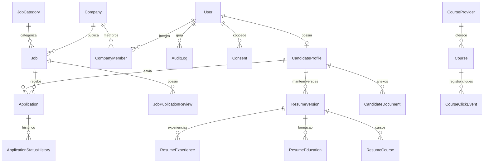

# Modelo de Dados — Emprega Arcoverde

O modelo de dados foi estruturado com o **Prisma ORM** e suporta tanto SQLite (para desenvolvimento local zero-config) quanto PostgreSQL para ambientes de produção.

---

## 1. Diagrama de Entidades Principais

---

## 2. Entidades Detalhadas

### 2.1 Identidade & Auditoria
- **`User`**: Usuário base com e-mail único, hash de senha e papel (`role`).
- **`Consent`**: Registro imutável de aceites de Termos de Uso, Política de Privacidade, e canais de comunicação (E-mail e WhatsApp).
- **`AuditLog`**: Trilha de auditoria das ações administrativas e de recrutamento (aprovação de vaga, alteração de status de candidato, downloads de currículos e exportações CSV).
- **`DeletionRequest`**: Protocolo de solicitação de exclusão/anonimização de dados (LGPD).

### 2.2 Empresas & Vagas
- **`Company`**: Cadastro institucional da empresa, CNPJ, contato, cidade e flag `isConfidentialDefault`.
- **`CompanyMember`**: Vinculação entre usuário e empresa com papel de gestão.
- **`JobCategory`**: Áreas de atuação (Administração, Comércio, Logística, TI, etc.).
- **`Job`**: Vagas com ciclo de vida (`DRAFT`, `PENDING_REVIEW`, `PUBLISHED`, `PAUSED`, `CLOSED`, `REJECTED`), requisitos, CNH, escolaridade, prazo e flag `isConfidential`.
- **`JobPublicationReview`**: Histórico de moderação da ACA/Prefeitura com justificativa e parecer.

### 2.3 Candidatos & Currículo Estruturado
- **`CandidateProfile`**: Dados pessoais, contato, cidade, escolaridade, CNH, flag `isAssisted`, identificação do operador e consentimentos.
- **`ResumeVersion`**: Snapshot imutável da versão do currículo digital com experiências, formações e cursos.
- **`CandidateDocument`**: Metadados de arquivos em anexo (PDF, DOCX, imagens) armazenados em diretório seguro.

### 2.4 Candidaturas & Triagem
- **`Application`**: Registro de candidatura vinculando vaga e candidato, com chave única composta `(jobId, candidateId)`, snapshot da versão do currículo, pontuação explicável de compatibilidade (`matchScore`) e status (`SUBMITTED`, `UNDER_REVIEW`, `CONTACT_SELECTED`, `INTERVIEW_SCHEDULED`, `APPROVED`, `NOT_SELECTED`, `WITHDRAWN`).
- **`ApplicationStatusHistory`**: Histórico temporal e auditado de cada mudança de status do processo seletivo.

### 2.5 Qualificação & Artigos
- **`CourseProvider`**: Provedores de qualificação (Prefeitura, Sebrae, Senai, Senac, etc.).
- **`Course`**: Cursos gratuitos com links externos e monitoramento de interesse.
- **`CourseClickEvent`**: Registro de métricas de redirecionamento para o parceiro.
- **`Article`**: Blog editorial institucional de orientação de carreira e notícias da Feira.
- **`UsefulLink`**: Atalhos governamentais (Carteira Digital, MEI, Seguro-Desemprego).
